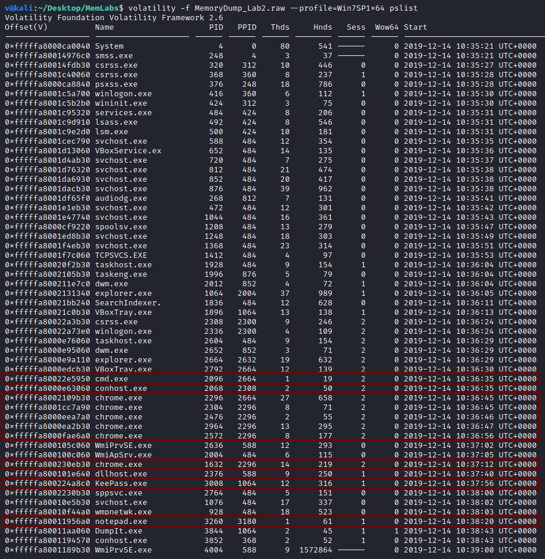
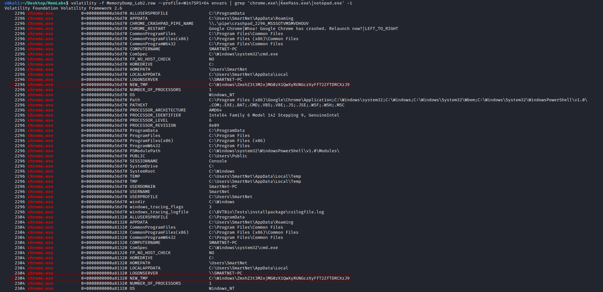
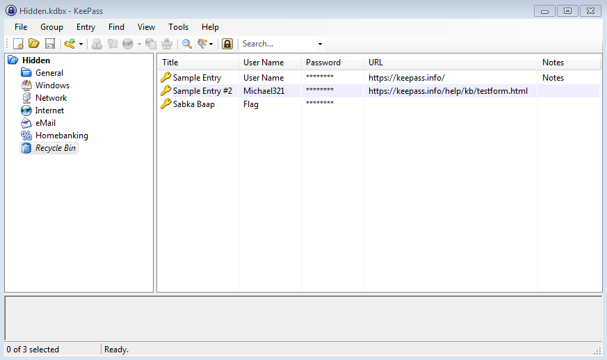
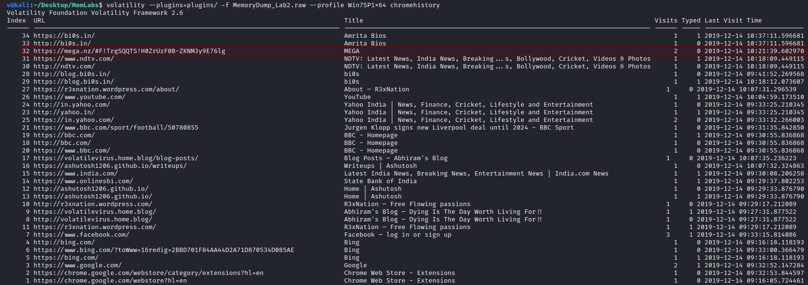
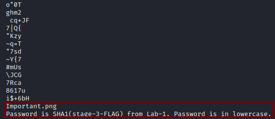

**A New World**
===================  
[Challenge Link](https://github.com/stuxnet999/MemLabs/tree/master/Lab%202)  

> One of our clients lost the access to his system due to an unknown error. He is supposedly a very popular "environmental" activist.  
> As a part of the investigation, he told us that his go to applications are browsers, his password managers, etc.  
> We hope that you can dig into this memory dump and find his important stuff and give it back to us.

The description gave me some hints:  
- We might find something interesting in the environment variables.
- We will be looking for browsers' processes (firefox.exe, chrome.exe, opera.exe, etc).  
- We will also be looking for password managers' processes (lastpass.exe, keepass.exe, dashlane.exe, etc).  

Let's use the [imageinfo](https://github.com/volatilityfoundation/volatility/wiki/Command-Reference#imageinfo) command to get the suggested profile which we will pass as the parameter to `--profile` when using other plugins.

  

Good, let's check the active processes when this memory dump was taken.. to do so, I will use the [pslist](https://github.com/volatilityfoundation/volatility/wiki/Command-Reference#pslist) plugin.

  

Let's check the environment variables.. to do so, I will use the [envars](https://github.com/volatilityfoundation/volatility/wiki/Command-Reference#envars) plugin.

  

I noticed this base64 encoded string, decoding it got me the first flag :D  

> **flag{w3lc0m3_T0_$T4g3_!_Of_L4B_2}**

--------------------------------------------
I didn't what to look for in the `KeePass.exe` process, so I googled.  
I learnt from this [article](https://www.techrepublic.com/article/how-to-manage-your-passwords-effectively-with-keepass/) that [KeePass](https://keepass.info/) stores the passwords in an encrypted database with `.kdbx` extension.. It's time for the [filescan](https://github.com/volatilityfoundation/volatility/wiki/Command-Reference#filescan) plugin.  

Let's dump it.. to do so, I will use [dumpfiles](https://github.com/volatilityfoundation/volatility/wiki/Command-Reference#dumpfiles) plugin and pass the physical address as a parameter to `-Q`  

After changing its name and extension, I downloaded [KeePass](https://keepass.info/) to open the database but I needed a password, let's scan again.  

Nice, let's dump it.

After changing its name and extension, I opened the picture.

Nice, let's use this password to open the database.

In the recycle bin, I found a user named flag, I copied its password which was our second flag :D

> **flag{w0w_th1s_1s_Th3_SeC0nD_ST4g3_!!}

--------------------------------------------
I thought of checking the browsing history in the `chrome.exe` process.  
There is no built-in plugin for that so after some googling I found this [blog](https://blog.superponible.com/2014/08/31/volatility-plugin-chrome-history/).  
I downloaded the repositery and put it in a newly-created folder in the same directory of the lab, now let's extract the browsing history.

I opened the link and got a zip file, I tried to extract its content but it was password-protected, I tried to brute-force it but no luck.  
Going through its `strings` I got the following.

Easy, I then extracted its content and got the last flag :D

> **flag{oK_So_Now_St4g3_3_is_DoNE!!}**

--------------------------------------------
