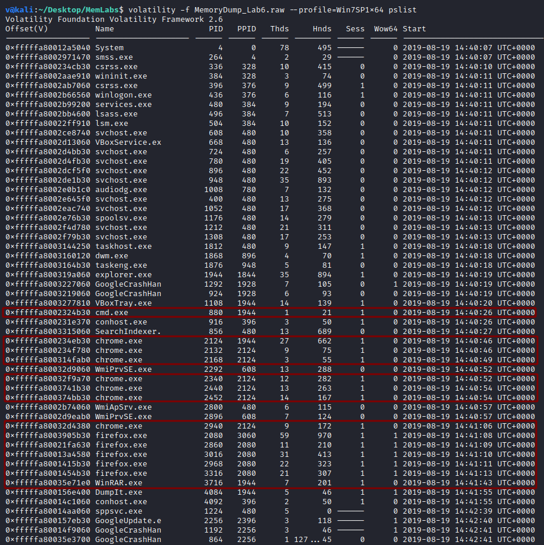
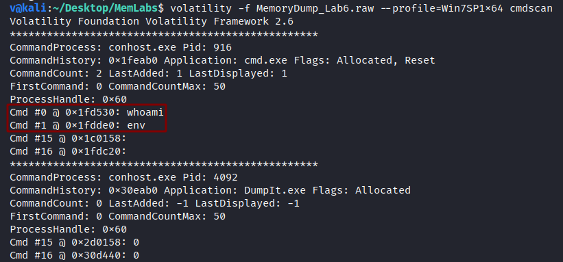
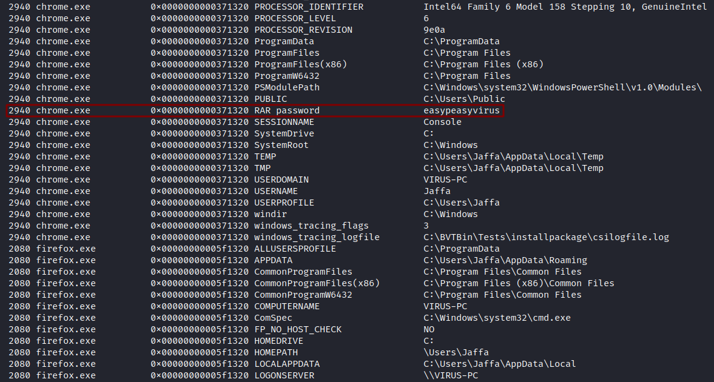
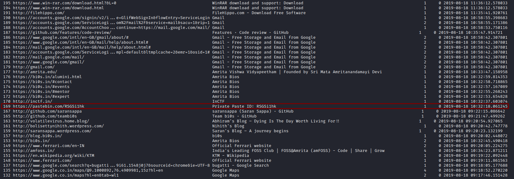

**The Reckoning**
===================  
[Challenge Link](https://github.com/stuxnet999/MemLabs/tree/master/Lab%206)  

> We received this memory dump from the Intelligence Bureau Department.  
> They say this evidence might hold some secrets of the underworld gangster David Benjamin.  
> This memory dump was taken from one of his workers whom the FBI busted earlier this week.  
> Your job is to go through the memory dump and see if you can figure something out.  
> Note: This challenge is composed of 1 flag split into 2 parts and its format is: inctf{s0me_l33t_Str1ng}

Let's use the [imageinfo](https://github.com/volatilityfoundation/volatility/wiki/Command-Reference#imageinfo) command to get the suggested profile which we will pass as the parameter to `--profile` when using other plugins.

  

Let's check the active processes when this memory dump was taken.. to do so, I used the [pslist](https://github.com/volatilityfoundation/volatility/wiki/Command-Reference#pslist) plugin.

  

Let's check the commands which were entered in the console shell.. to do so, I used the [cmdscan](https://github.com/volatilityfoundation/volatility/wiki/Command-Reference#cmdscan) plugin.

  

I think `env` is a clue, let's check the environment variables.. to do so, I used the [envars](https://github.com/volatilityfoundation/volatility/wiki/Command-Reference#envars) plugin.  
Going through the output I noticed the following:

  

Interesting! We may need it later.  
Let's proceed to the next process, I used the [chromehistory](https://blog.superponible.com/2014/08/31/volatility-plugin-chrome-history/#chromehistory) plugin to check the recently-visited sites.  
Going through the output I noticed the following:

  

I opened the link and it had a google drive link, I opened it and went through what was written.. I noticed the following:

  

I opened the link and it was password-protected.  
Back to the memory dump, I searched for the password but found nothing.  
I thought of searching the `strings` output of the memory dump for mega, I got the following: 

Let's `grep` the key then, I got the following: 

I got a picture from mega after entering the password, I tried to open it but it was corrupted.  
I opened it in a hexeditor, the signature was correct, so after some googling I found the full-correct-header structure from [here](https://social.msdn.microsoft.com/Forums/en-US/bb30d088-d21f-4a9c-bf84-79c58f042a10/access-image-metadata-description?forum=iewebdevelopment).  
I fixed it and got the first part of the flag :D

Remember the password we got earlier? let's search for `.rar` files then.. to do so, I used the [filescan](https://github.com/volatilityfoundation/volatility/wiki/Command-Reference#filescan) plugin.

Nice! let's dump it.. to do so, I used the [dumpfiles](https://github.com/volatilityfoundation/volatility/wiki/Command-Reference#dumpfiles) plugin.

I extracted it using the password we got to find the second part of the flag :D

--------------------------------------------
